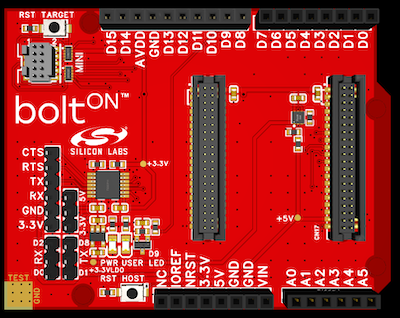

 **by Silicon Labs**

**boltON** is an expansion board for your development kits, which adds wireless functionality to them.

The hardware is an open-source Arduino Uno shield form factor PCB, which can be bolted on top of your existing dev boards.

## Hardware overview

### Features
 - Arduino Uno shield connector (follows the standard Arduino shield pinout)
 - Radio board connector (for connecting Silicon Labs radio boards)
 - Mini Simplicity connector (for programming the radio board with an external programmer)
 - Power LED
 - User LED (connected to the D9 pin on the Arduino shield connector)
 - Reset button for the host MCU
 - Reset button for the target MCU (radio board)
 - UART header (CTS/RTS/TX/RX/GND/3.3V) - exposes the UART connector of the radio board for external connections
 - Host MCU voltage selector (5V/ /3.3V) - use a jumper to select the voltage of the host MCU
   - The radio board always uses 3.3V - when selecting 5V on this header a level shifter is used to convert to the correct voltage levels
 - UART RX pin selection (D2/RX/D0) (use a jumper to select between D2 and D0 as an UART RX pin)
   - Some host development kits have different UART mappings - this can be used to select an alternative UART mapping
 - UART TX pin selection (D8/TX/D1) (use a jumper to select between D8 and D1 as an UART TX pin)
   - Some host development kits have different UART mappings - this can be used to select an alternative UART mapping

### Hardware design files

The hardware design files can be found in the [Silicon Labs Open PCB Prototypes](https://github.com/SiliconLabsSoftware/open-pcb-prototypes/tree/main/boltON_extension_board) repository.

## Setting up your boltON hardware

The boltON shield has a standard Silicon Labs radio board connector, which can accept any BLE compatible Silicon Labs radio board.
For using Bluetooth Low Energy with boltON, the radio board on the shield needs to be flashed with the BLE NCP firmware.

To achieve this you need a method to program your radio board. The most straightforward one is using a [Wireless Starter / Pro Kit](https://www.silabs.com/development-tools/wireless/efr32xg22-wireless-starter-kit) form Silicon Labs.

### Flashing the NCP firmware
 - Place your radio board into your WSTK / Pro Kit
 - Launch `Simplicity Studio`
 - Find and click your board in the `Debug Adapters` view
 - Select the `Example Projects & Demos` tab at the top
 - Click `Run` on the `Bluetooth - NCP` demo
   - This flashes the NCP firmware alongside the necessary bootloader
- Place you radio board back to the boltON board
- Connect your boltON to your development kit you wish to use it with

### UART flow control

By default, the BLE NCP firmware has the hardware flow control on the UART enabled.
The boltON shield does not have the flow control pins exposed on the Arduino shield connector.
The boltON shield has the flow control pins of the radio board exposed on the UART header on the left side of the board.
To use flow control users shall connect the flow control pins (CTS/RTS) on the boltON board with the flow control pins of the underlying development kit in order for the NCP firmware to work.

Alternatively users can modify the NCP firmware to disable flow control. This allows the boltON board to be used without external wiring.
The downside of disabling flow control is potential packet loss in very high traffic situations - like BLE scanning in a busy area.
Users are always advised to use UART flow control when experiencing packet loss during operation.

#### Steps to disable flow control:
 - Complete all the steps in [Flashing the NCP firmware](#Flashing-the-NCP-firmware), but leave your radio board in the WSTK
   - This is necessary to have the correct bootloader flashed
 - In the `Example Projects & Demos` tab click `Create` on the `Bluetooth - NCP` example
 - Once the project has been created, navigate to the main project page
 - Click the `Software Components` tab at the top
 - Search for `UART` - filter to just installed components to make it easier
 - Find `UARTDRV Core` under `Driver > UART`
 - Click the cog icon next to its name
 - Set `Flow control support` to `Disable`
 - Recompile and flash your project to the radio board

## Supported vendors and boards

### STMicroelectronics

Example projects for STM32 boards can be found under the `STM32` folder. Each example is an STM32 Cube IDE IOC project, which can be imported into the IDE.

#### Boards
 - [STM32 Nucleo F411RE](https://www.st.com/en/evaluation-tools/nucleo-f411re.html)
   - Please select the `UART RX` pin as `D2` and the `UART TX` pin as `D8` on the boltON hardware when using this kit
 - [STM32 Nucleo H743ZI2](https://www.st.com/en/evaluation-tools/nucleo-h743zi.html)

#### Examples
 - NCP host (F411, H743)
 - NCP commander (F411)
 - BLE blinky (F411)
 - SPP (F411)

## Example overview

### Simplicity Connect app

The recommended tool for interacting with the examples is the `Simplicity Connect` mobile app.

Get the `Simplicity Connect` app for:
- Android: https://play.google.com/store/apps/details?id=com.siliconlabs.bledemo
- iOS: https://apps.apple.com/us/app/efr-connect-ble-mobile-app/id1030932759

### NCP host

This is a basic boilerplate example, which serves as a starting point for users wishing to develop BLE solutions with boltON.

The example sets up the Silicon Labs BLE stack and starts a BLE advertisement. It also accepts connections and turns on the onboard LED when a connection is established - and turns it off on disconnection. The example also logs state changes on UART.

### BLE blinky

This example implements basic BLE functionality and allows users to control the onboard LED and receive notification when the onboard button is pressed.

Functionality of this example can be tested with the [Simplicity Connect](#Simplicity-Connect-app) mobile app.

### NCP commander

This example allows the users to use the Silicon Labs [NCP Commander](https://docs.silabs.com/simplicity-studio-5-users-guide/latest/ss-5-users-guide-tools-bluetooth-ncp-commander/) desktop app to interact with the BLE device end evaluate its functionalities.

### SPP

The Serial Port Profile (SPP) example allows the users to send data through BLE in a bidirectional way similar to UART.

The example allows the hardware to connect to a web app running in the user's browser and exchange messages between with the hardware wirelessly.
